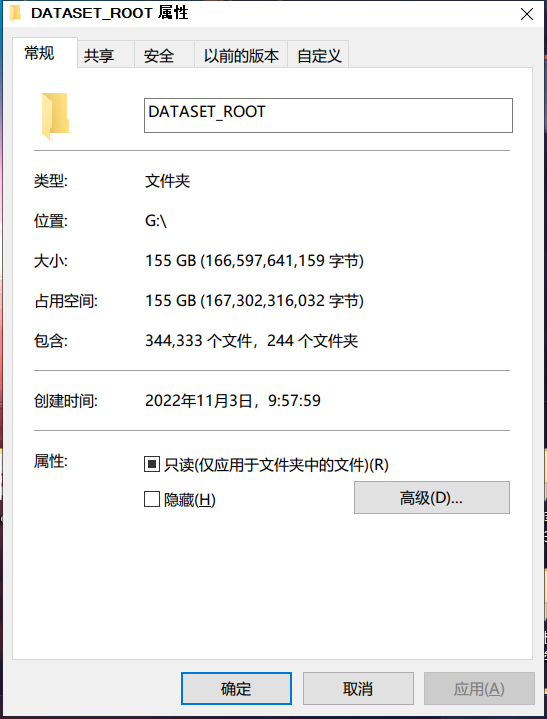
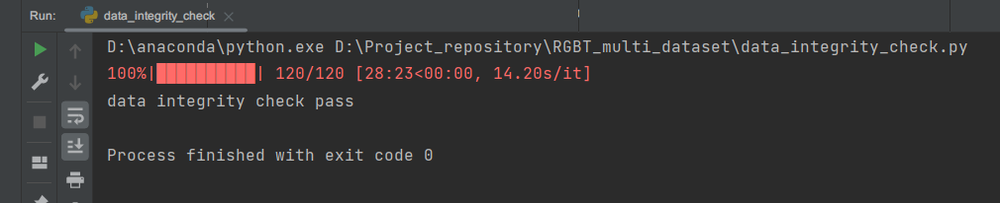

[//]: # "- show_gt: 可视化"

[//]: # "- countMDMT: 统计"

[//]: # "- get_first_frame: 统计第一帧"

[//]: # "- make_csv: 制表"

# H1
## 解析数据

原始标注格式：

```xml

<annotations count="19">
    <track id="0" label="person">
        <box frame="0" xtl="137" ytl="26" xbr="153" ybr="65" outside="0" occluded="0">
            <attribute id="65">30m</attribute>
            <attribute id="67">bright_light</attribute>
            <attribute id="69">not_keep_out</attribute>
            <attribute id="71">not_shake</attribute>
            <attribute id="73">stadium</attribute>
        </box>
    </track>
</annotations>
```

```python
xml_dict = {
    "annotations_count": 19,
    "tracks_list": [
        {  # track_dict
            "id": 0,
            "label": "person",
            "box_list": [
                # box_dict
                {
                    "frame": 0,
                    "xtl": 137,
                    "ytl": 26,
                    "xbr": 153,
                    "ybr": 65,
                    "outside": 0,
                    "occluded": 0,
                    "attributes_dict": {
                        "altitude": "30m",
                        "illumination": "bright_light",
                        "keep_out": "not_keep_out",
                        "shake": "not_shake",
                        "scene": "stadium"
                    }  # attributes_list
                }  # box_dict
            ]  # box_list
        },  # track_dict
        {...}  # track_dict
    ]  # tracks_list
}
```

## 新的数据格式
原始标注格式：

```xml

<annotations count="101" altitude="120m" scene="street" illumination="bright_light">
	<track id="0" label="person">
		<box frame="0" xtl="103" ytl="475" xbr="116" ybr="495" outside="0" occluded="0"></box>
		<box frame="1" xtl="103" ytl="473" xbr="116" ybr="493" outside="0" occluded="0"></box>
    </track>
</annotations>
```

```python
xml_dict = {
    "count": 19,
    "altitude": "120m",
    "scene": "street",
    "illumination": "bright_light",
    "tracks_list": [
        {  # track_dict
            "id": 0,
            "label": "person",
            "box_list": [
                # box_dict
                {
                    "frame": 0,
                    "xtl": 137,
                    "ytl": 26,
                    "xbr": 153,
                    "ybr": 65,
                    "outside": 0,
                    "occluded": 0,
                }  # box_dict
            ]  # box_list
        },  # track_dict
        {...}  # track_dict
    ]  # tracks_list
}
```
## 统计数据集

### scalar

#### sequence level

-[x] number of sequences
-[x] average number of frames per sequence
-[x] average tracks per sequence

#### category level

-[ ] number of categories
-[ ] distribution of categories

#### scene level

-[ ] number of scenes
-[ ] distribution of scenes

## 数据集

- DATASET_ROOT

  - sequence  # 存放视频序列，图片形式

    - 1
      - 1.jpg
      - 2.jpg
    - 2
    - ...

  - annotations  # xml格式的数据标注

    - 1.xml
    - 2.xml
    - ...

  - train.txt  # 训练集划分

    > 1
    >
    > 2
    >
    > 3
    >
    > ...

  - val.txt  # 验证集划分

  - test.txt  # 测试集划分


## 其它参考数据集

### VisDrone

- VisDrone2019-SOT-val

  - annotations

    - uav0000024_00000_s.txt

      > 608,404,27,84
      > 609,404,28,83
      > 610,404,29,82
      > 611,405,30,81
      > 612,405,31,80

    - attributes

      - uav0000024_00000_s_attr.txt

        > 1,1,1,0,1,1,0,0,1,1,1,1

      - ...

  - sequences
    - uav0000024_00000_s
      - img0000001.jpg
      - img0000002.jpg
      - ...
      - ...

### VOC

```
VOC_ROOT     #根目录
    ├── JPEGImages         # 存放源图片
    │     ├── aaaa.jpg     
    │     ├── bbbb.jpg  
    │     └── cccc.jpg
    ├── Annotations        # 存放xml文件，与JPEGImages中的图片一一对应，解释图片的内容等等
    │     ├── aaaa.xml 
    │     ├── bbbb.xml 
    │     └── cccc.xml 
    └── ImageSets          
        └── Main
          ├── train.txt    # txt文件中每一行包含一个图片的名称
          └── val.txt
```
TCSVT
### Visual-Thermal

- train_ST_002

  - bus_033

    - mask

      - rgb
        - 000000.png
        - 000030.png
        - ...

    - rgb

      - 000000.jpg
      - 000001.jpg
      - ...

    - rgb.txt

      > 1112 249 225 382
      > 1100 227 215 383
      > 1076 208 215 383
      > 1056 195 214 379
      > 1030 187 216 373
      > 1006 173 218 373
      > 977 177 215 364
      > 953 165 217 370

  - cable_001

  - ...




- 有些红外和可见光不匹配，记录在mismatch.txt中

## Misalignment(Fixed, Backed up in ext drive)
- 0
- 33 small target
- 46
- 48
- 61

## Temporal Misalignment
It seems that IR is 1 second ahead or behind RGB

# Steps:
1. run dataset_analysis.ipynb to get the statistics of the dataset and split the dataset into train, val, test
2. run rgbt2motcoco.py to convert the dataset into MOTCOCO format, and organize pictures into folders